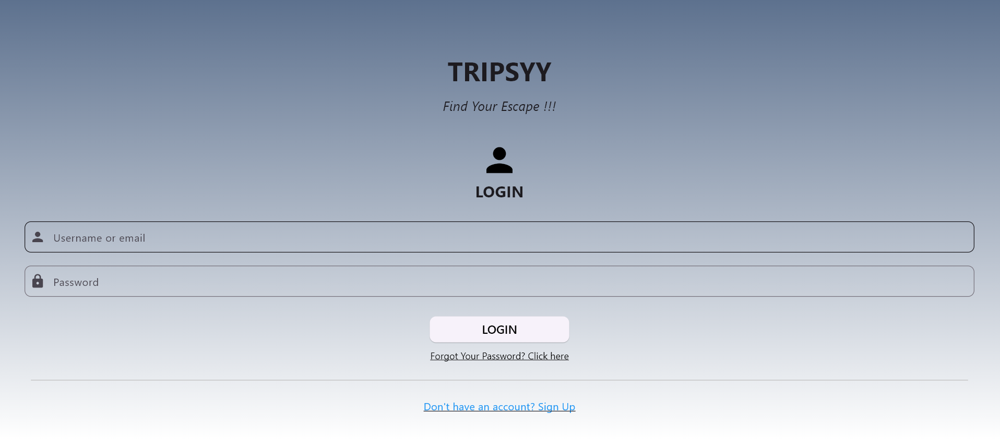
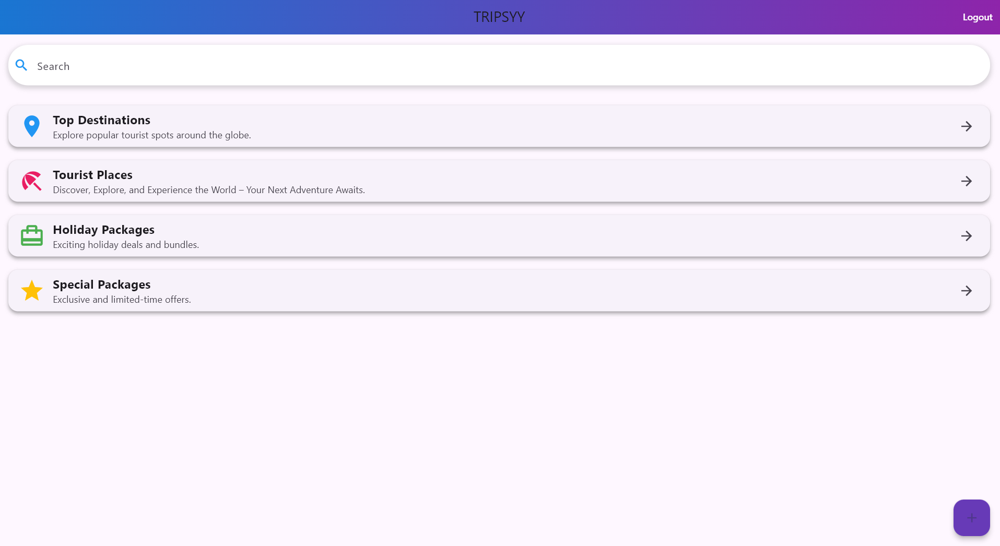
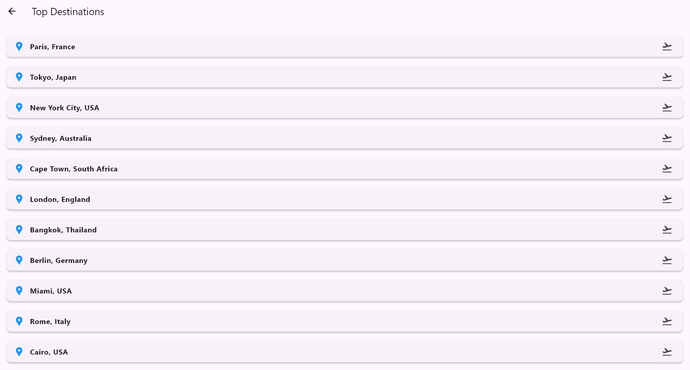
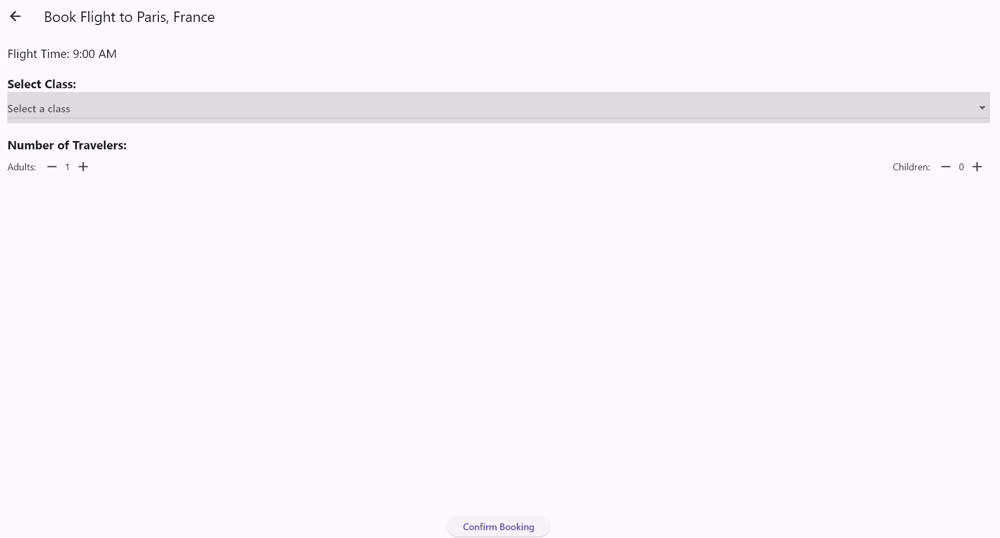
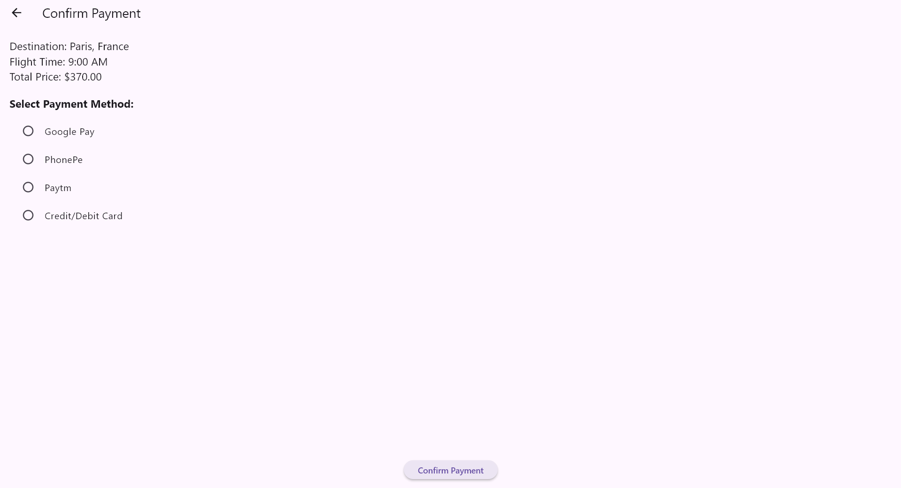

# TRIPSYY - Find Your Escape !!!

Tripsy is a comprehensive travel and tourism application built with **Flutter**. It allows users to discover top destinations, book flights, and explore various holiday packages seamlessly.

## 📱 Features

- **User Authentication**:
  - Secure Login and Signup pages.
  - Gmail validation and strong password requirements.
  - Forgot Password functionality.

- **Explore Destinations**:
  - **Top Destinations**: Browse a curated list of popular cities globally (Paris, Tokyo, New York, etc.).
  - **Tourist Places**: Discover specific tourist spots.
  - **Holiday Packages**: View exciting holiday deals.
  - **Special Packages**: Exclusive limited-time offers.

- **Flight Booking System**:
  - Select flights based on timing and price.
  - Choose travel class: **Economy**, **Premium**, or **Business** (with dynamic pricing).
  - Manage number of travelers (Adults & Children).
  - Real-time price calculation.

- **Modern UI/UX**:
  - Clean and intuitive interface.
  - Smooth animations and transitions.
  - Responsive design.

## � Releases

### v1.0.0 - Initial Release (Latest)
**📅 Released:** Feb 06, 2026

**Downloads:**

| Asset | Type | Size | Link |
|:------|:-----|:-----|:-----|
| 📦 **Tripsy.apk** | Android Installer | ~45 MB | [⬇️ **Download APK**](https://github.com/shashirajj7/tripsy-app/raw/main/Tripsy.apk) |

> **Requirement**: Android 7.0 (API 24) or higher.
>
> *Download the APK above and install it on your device to test the app.*

## 🛠️ Tech Stack

- **Framework**: [Flutter](https://flutter.dev/)
- **Language**: [Dart](https://dart.dev/)
- **Icons**: Cupertino Icons, Material Icons

## 🚀 Getting Started

To run this project locally, follow these steps:

### Prerequisites

- Flutter SDK installed (Version 3.10.8 or higher recommended).
- Android Studio or VS Code set up for Flutter development.

### Installation

1.  **Clone the repository**:
    ```bash
    git clone https://github.com/shashirajj7/tripsy-app.git
    cd tripsy_app
    ```

2.  **Install dependencies**:
    ```bash
    flutter pub get
    ```

3.  **Run the app**:
    ```bash
    flutter run
    ```

4.  **Build APK** (Optional):
    ```bash
    flutter build apk --release
    ```

## 📸 Screenshots

## 📸 Screenshots

<p align="center" float="left">
  
   
  
  
  
</p>

## 📄 License

This project is licensed under the MIT License - see the LICENSE file for details.

---
*Developed with ❤️ by Shashi Raj*
